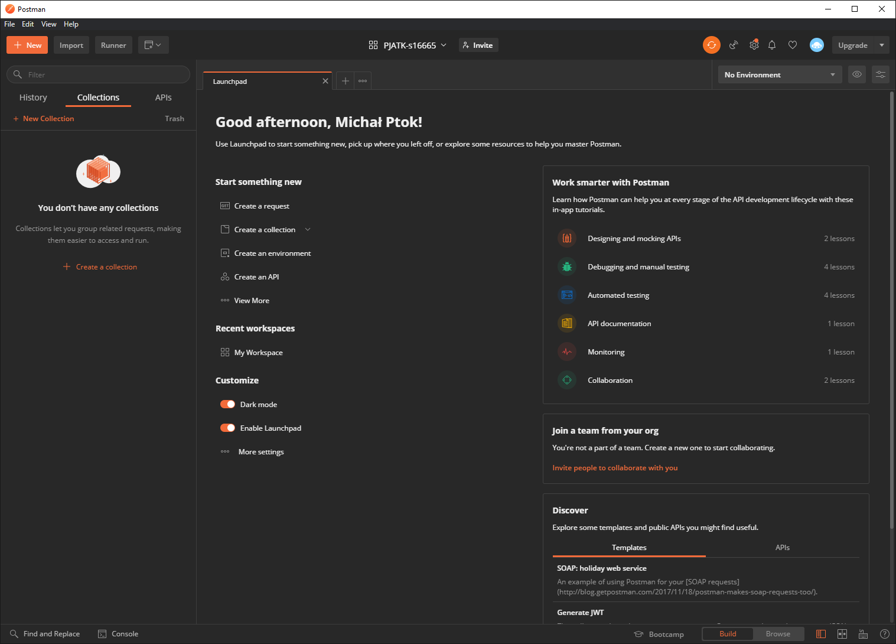
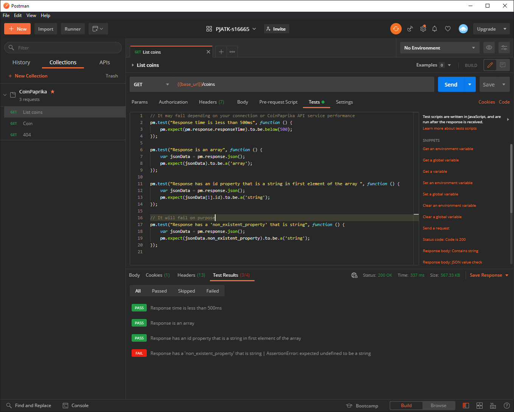
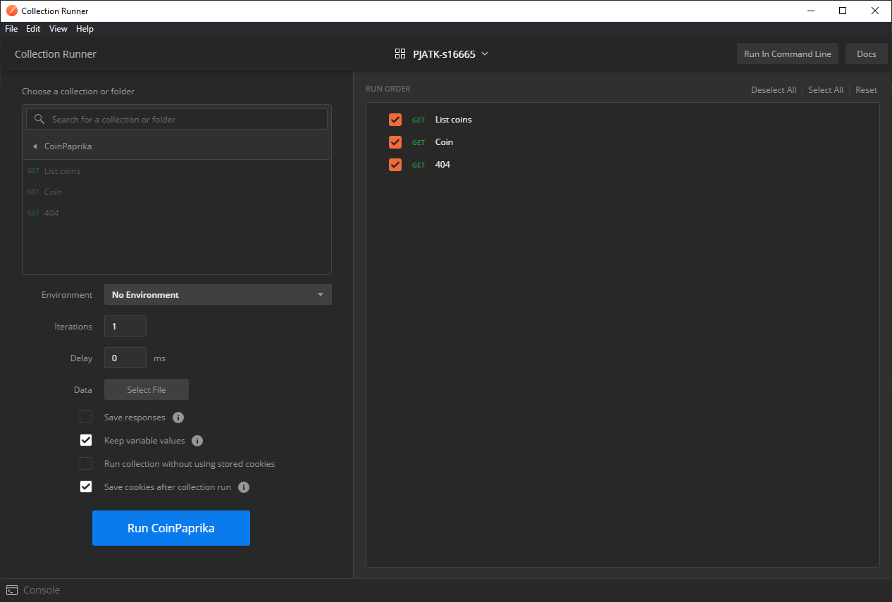
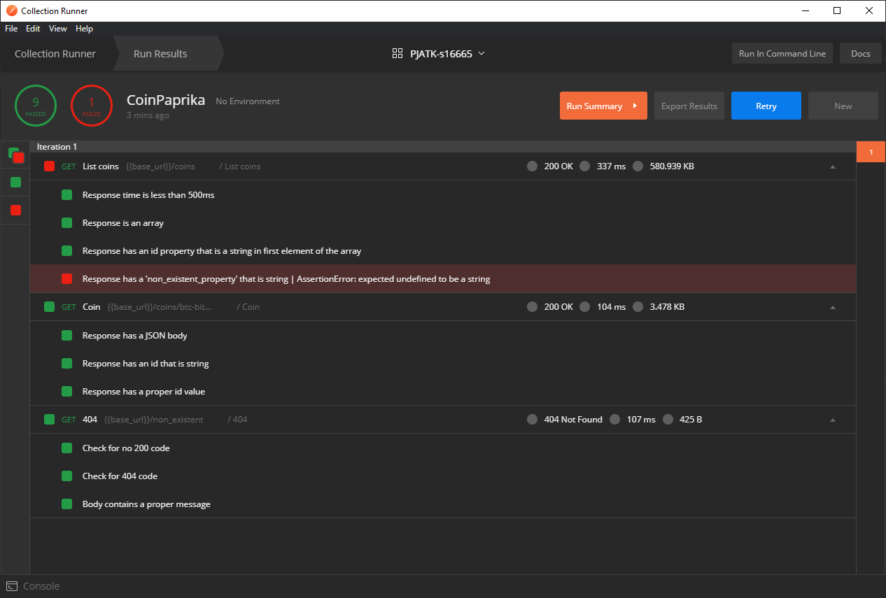
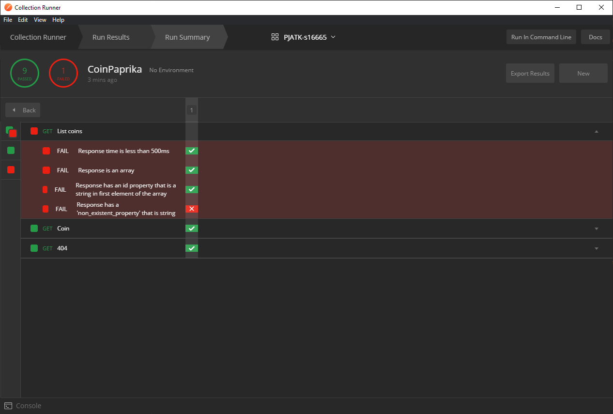

# [Postman](https://www.postman.com/) - as an API automation testing tool

---

**Postman** is a robust tool for API automation testing & development. Postman has features that helps you create, send and manage HTTP requests and related tests. You can collaborate across your team.

> This guide focuses on using Postman as an API automation testing tool, not on the Postman app itself!

## Installation

- [Download](https://www.postman.com/downloads/) the app for Windows, Mac or Linux. You may want to create an account to store your data between these platforms.

    **or**

- Create an account and use the postman [online](https://identity.getpostman.com/signup).

## First steps

If Postman is entirely new thing for you, then check out the [official introduction page](https://learning.postman.com/docs/getting-started/introduction/). Additionally Postman offers starting guide called `Bootcamp` and it is available at the bottom bar in the app.



## API Testing

### Preparation

I have already prepared my collection file that you can find [here](./collections./CoinPaprika.postman_collection.json). In the Postman use `Import` button (top left corner) and then drag the collection file to the `Import` window.

The collection uses [CoinPaprika API](https://api.coinpaprika.com).

### Manual testing

Open `List coins` request. Switch to the `Tests` tab. Press `CTRL + Enter` on your keyboard or click `Send` button. You will see response section at the bottom. Go to the `Test Results` tab.

You can test `Coin` and `404` requests in the same way. Each request have diffrent set of tests.



**Single test example:**

```javascript
// It may fail depending on your connection or CoinPaprika API service performance
pm.test('Response time is less than 500ms', function () {
    pm.expect(pm.response.responseTime).to.be.below(500);
});
```

### Automated test

#### Running

Use `Runner` button to open `Collection Runner` window. You can drag up and down single request (and its tests) in the `RUN ORDER` section. Select `CoinPaprika` collection and press the `Run CoinPaprika` button.



#### Results

Once the test are done you will see the results.


Press `Run Summary` to hide unnecessary details. Additionaly you can export the results.



## Collection Summary

CoinPaprika collection has variable `base_url`. Collection (Click RMB) ➡ `Edit` ➡ `Variables` tab ➡ Set your variables & values ➡ `Update`.
Each request uses `base_url` as a prefix for URL.

You can modify the collection by using remaining tabs in the `Edit Collection` window.

No additional params, headers or authorization was needed to hit CoinPaprika API. Collection uses Postman default configuration.

## About

Created by Michał Ptok for educational purposes.

---

> Thanks to the awesome creators of CoinPaprika API 💰 and Postman Tool 📨📩
